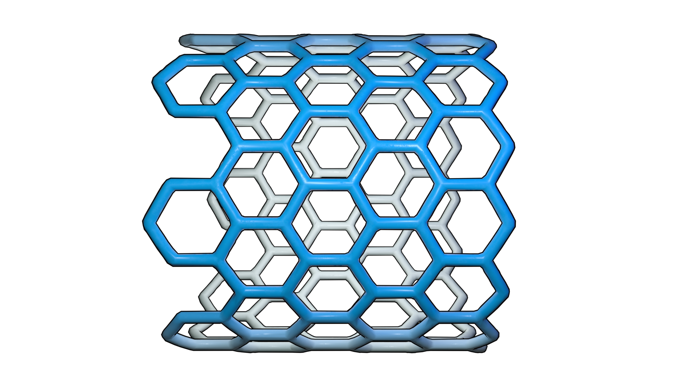

# MEW Gcode render

MEW GCode Render converts GCode files from melt electrowrite (MEW) 3D printing into publication-ready 3D visualizations in Blender. The pipeline follows GCode → CSV → Blender, providing a Python program that transforms GCode into CSV point data with support for cylindrical coordinate transformations (useful for tube-based scaffolds), along with prebuilt Blender geometry nodes for efficient rendering of the point trajectories as 3D meshes.

[Examples](./examples/) | [Blender](https://www.blender.org/) | License: [MIT](./LICENSE.md)



## Key features

- **GCode to CSV Conversion**: Directly parse GCode files and export point trajectories to CSV format
- **Cylindrical Coordinate Transformation**: Support for converting Cartesian coordinates to cylindrical coordinates, ideal for MEW scaffold printing on tubular structures
- **Blender Integration**: Prebuilt geometry node templates for seamless import and visualization of CSV point data
- **Efficient Rendering**: Node-based workflow enables fast real-time visualization and animation of print paths
- **Command-line Interface**: Simple CLI for batch processing and automation of GCode conversions

## How to use the software

### Step 1: Convert GCode to CSV (Python)

Run the Python script to convert your GCode file to CSV format. This generates a CSV file with x, y, z coordinates of the print path.

#### CLI Reference

```sh
python -m mew_gcode_render <gcode_file> [options]
```

**Positional Arguments:**
- `<gcode_file>`: Path to the GCode file to convert

**Optional Arguments:**

| Argument | Short | Type | Default | Description |
|----------|-------|------|---------|-------------|
| `--diameter` | `-d` | float | 0 | Diameter of the tube in mm. Set > 0 to enable cylindrical transformation |
| `--thickness` | `-t` | float | 0 | Thickness of the tube wall in mm (affects scaling) |
| `--x_axis` | `-x` | str | x | Axis mapping for X coordinate (x, y, or z) |
| `--y_axis` | `-y` | str | y | Axis mapping for Y coordinate (x, y, or z) |
| `--z_axis` | `-z` | str | z | Axis mapping for Z coordinate (x, y, or z) |
| `--cylindrical_long_axis` | `-c` | str | x | Long axis for cylindrical transformation (x, y, or z) |
| `--curve_resolution` | `-r` | int | 20 | Number of points to sample per curve segment |

**Examples:**

Convert GCode that uses U for rotational axis with cylindrical transformation for a 3mm diameter tube:
```sh
python -m mew_gcode_render file.gcode -d 3 -y u -c x
```

Convert with custom axis mapping and higher resolution:
```sh
python -m mew_gcode_render file.gcode -x y -y x -z z -r 50
```

Convert with tube diameter and wall thickness:
```sh
python -m mew_gcode_render file.gcode -d 5 -t 0.5 -r 25
```

### Step 2: Visualize in Blender

#### Setup (one-time):

1. **Add geometry node template to asset library**
   - Open Blender
   - Edit → Preferences → File Paths → Asset Libraries
   - Add the folder `./blender_templates`

2. **Install CSV Importer extension**
   - Edit → Preferences → Get Extensions
   - Search for "CSV Importer" and install

#### Import and render:

3. **Import the CSV file and apply geometry nodes**
   - File → Import → CSV → Select your generated CSV file
   - Select the imported object
   - Open the Geometry Nodes panel → Click "New"
   - In the Asset Browser, navigate to `blender_templates`
   - Drag `CSV Paths to Mesh` node into the geometry node tree
   - Connect it between the input and output nodes

4. **Visualize the result**
   - Press Space to play the animation and visualize the print path as a 3D mesh  

5. **Creating Low-poly mesh**
   - Add modifier `Remesh` > voxel to join the segments from geometry node mesh
   - Add modifier `Decimate` > Collapse 0.1 to decrease faces
   - Convert to mesh for any post-processing 

#### BlenderKit models
- [Aidan Sanderson's Geometry Nodes Based Toon Outliner](https://www.blenderkit.com/asset-gallery-detail/c24aebfb-dd3c-4bde-95c7-dd2587acd6e9/)
- [Sivix gamer's  Bright Green Blue Plastic Gradient](https://www.blenderkit.com/asset-gallery-detail/c24aebfb-dd3c-4bde-95c7-dd2587acd6e9/)